# Traffic Project of CS50ai
#### View My Video on YouTube](https://youtu.be/jI4khWQ8qZM)
#### Description: 
# Introduction
My mainly work was creating the code of data_load() and get_model().
In data_load() function, I had to transfer images in each category into two lists, one is for images, the other is for labels, with the help of os and cv2 library. 
In get_model() function, I created a model beginning with a Sequential layer in Keras. Keras and its Sequential allow me to build a model layer by layer, with the add() function.

Firstly , I generated a shallow neural network: one layer convolutional, one layer of max_pooling and fully connected layer. They are the basic three layers in a standard CNN. And then I got the following model.
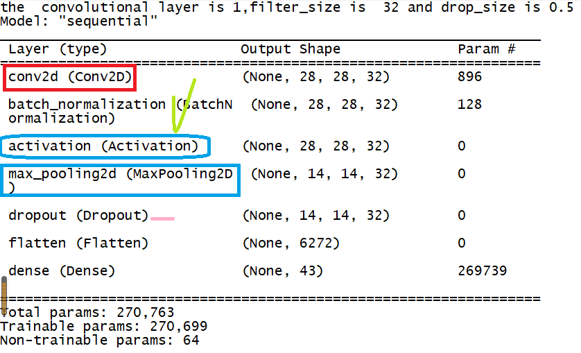  

Then I set learning rate 0.01, which is quite high. The running result is too bad to be used, while the parameters are keeping unchanged just given by Brian Yu, as the following:
| Parameter Name | Value |
| ----           | ----  |
| EPOCHS         | 10    |
| IMG_WIDTH      | 30    |
| IMG_HEIGHT     | 30    |
| NUM_CATEGORIES | 43    |
| TEST_SIZE      | 0.4   |
| LEARING_RATE   | 0.01  |
| OPTIMIZER      | ADAM  |   
| loss           |categorical_crossentropy|

# Training and Testing
You can see the bad result in my computer as the following: (after 10 Epochs, the accuracy is only 0.05, so this learning rate is not good.)
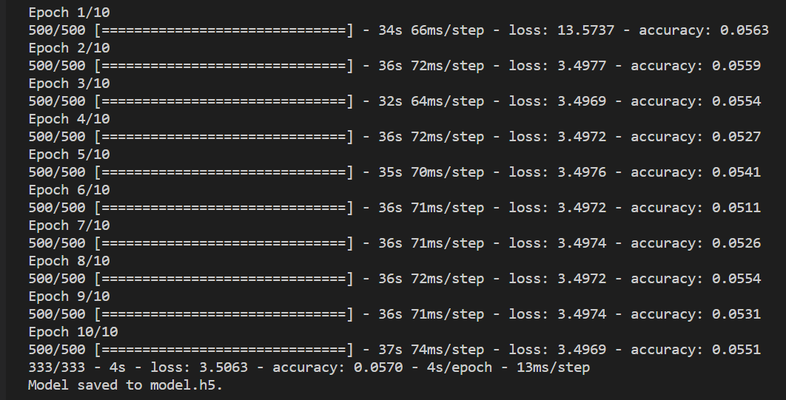

Then I set model's learning rate at 0.001.
I have tried 27 configurations. I did not set dense layer in hiden layers. And epoch_accuracy is shown as the following:
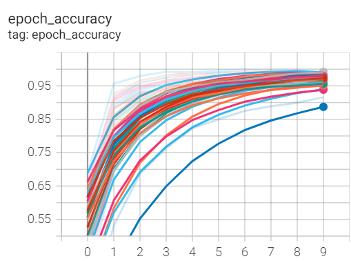  

And the parameters are as the following:
| filter_size | dropout | conv_layer | filter_size| dropout| conv_layer |filter_size | dropout | conv_layer |
|-------------|---------|------------|------------|--------|------------|------------|---------|------------| 
|32           | 0.1     | 1          | 32         | 0.1    | 2          | 32         |0.1      |3           |          
|64|0.1|1| 64 |0.1|2| 64|0.1|3|
|128|0.1|1| 128| 0.1|2|128|0.1|3|
|32|0.3|1| 32| 0.3|2| 32|0.3|3|
|64|0.3|1| 64|0.3|2|64|0.3|3|
|128|0.3|1| 128|0.3|2|128|0.3|3|
|32|0.5|1| 32|0.5|2|32|0.5|3|
|64|0.5|1|64|0.5|2|64|0.5|3|
|128|0.5|1| 128|0.5|2|128|0.5|3|

New Configurations: 
|filter_size|dropout|conv_layer|pool_size|
|-----------|-------|----------|---------|
|32|0.5|3|[2,2]|
|62|0.5|3|[2,2]|
|128|0.5|3|[2,2]|
|32|0.5|3|[3,3]|
|64|0.5|3|[3,3]|
|128|0.5|3|[3,3]|
|32|0.1|3|[5,5]|
|64|0.1|3|[5,5]|
|128|0.1|3|[5,5]|

There is a Dense layer after the Flatten layer, and then the data will enter into categorization. I set other hyperparameters as the following: Dropout is 0.5, conv=[1, 2], filter_size =[32, 64, 128].
The accuracy result is as the following picture, which includes sample accuracy, out of sample ccuracy, validation and test accuracy. 
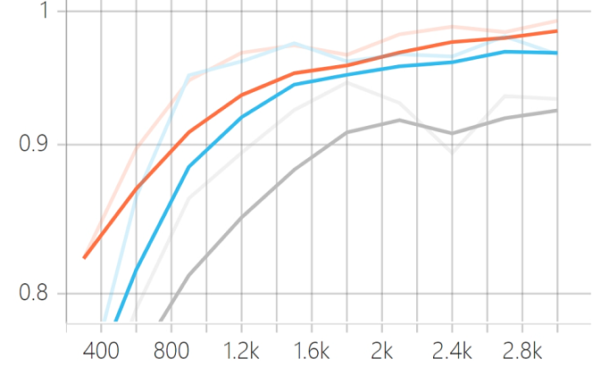
 
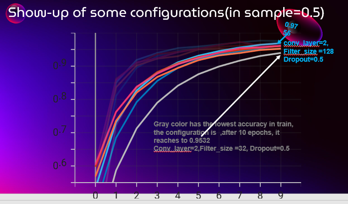
 
In the above picture, the blue one is the best, in which there are 2 convolutional layers, the filter size is 128, and the dropout rate is 0.5. The lowest gray one is the worst (convolutional layer=2, filter_size =32, dropout=0.5). The only different parameter is filter_size, from 32 to 128, while the accuracy is improved from 0.9532 to 0.9755. If I reduced the convolutional layer size to 1, the accuracy rate was alse worse than the best.

# Validation
The following picture shows the results from the out of sample (which means validation and test results). Both the best and the worst were pointed by the colorful arrows, while the other results stay between the best one and the worst one and their model parameters also between them.

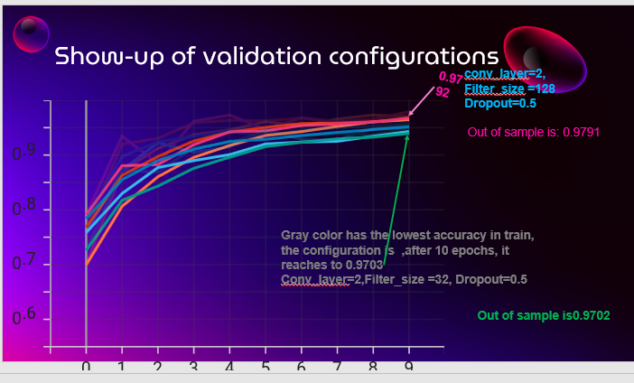 
In the above the picture, both validation and test have the same configuration layers. The best and worst model are with the following parameters: 
(1) The best (accuracy rate 0.9792 in test and 0.9791 in test): 
conv_layer size = 2 
filter_size = 128 
 dropout = 0.5 
（2）The worst (0.9703 in validation and 0.9702 in test): 
 conv_layer = 2 
 filter_size = 32 
 dropout = 0.5 
These two convolutional layers can be summarized as follows: 
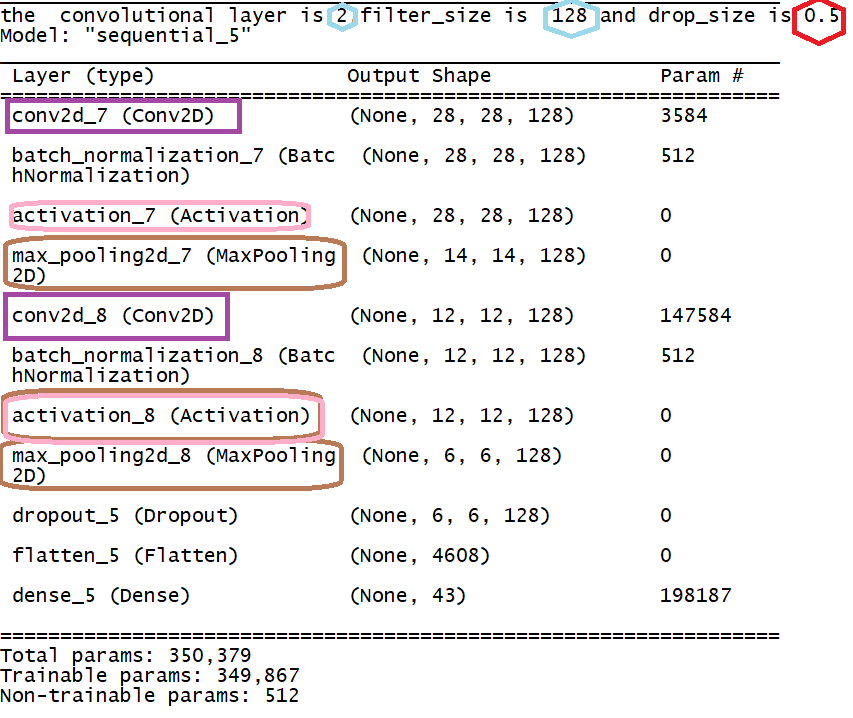

# Three Convolutional Layers
What about the three convolutional layers? I changed conv_layer to 3, and the hyperparameters of dropout is at 0.1 or 0.3. The Model summary is as follows: 

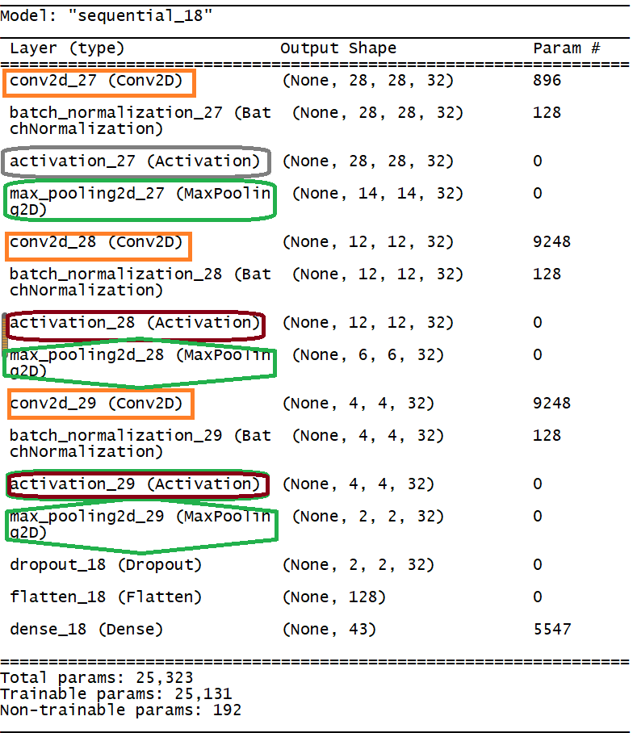

The results are showed as follow: 
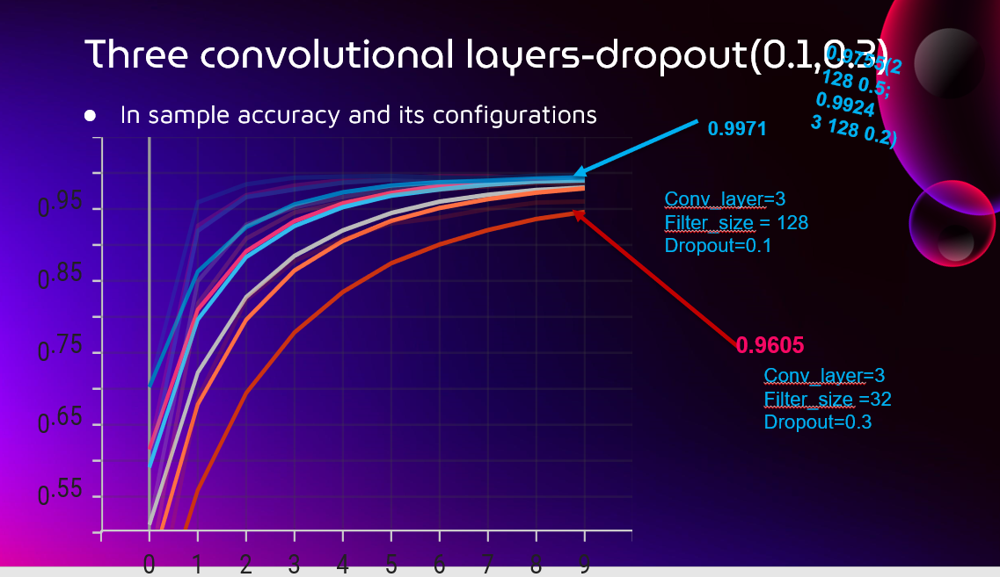

Therefore, I got  the highest accuracy 0.9971 in sample!
(dropout=0.1) . while in the out-of-sample, the result in validation is 0.9778 with the configuration at [3,128,0.1].
# Other Results
Now let's look at the out-of-sample(validation and test). We can see clearly from the following picture, with the same configuration the in-sample accuracy rate is 0.9778, while the out-of-sample dropped a lot (the validation is 0.8469 and the test is 0.8723). 
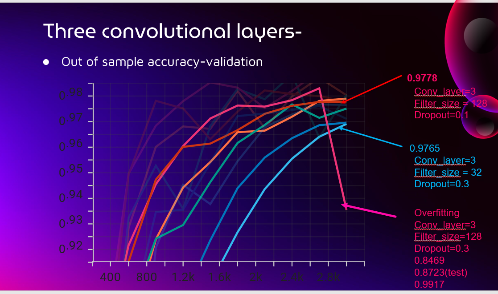

Other configurations of the model are showed as follows,is three conv_layers,filter_sizes are [32, 62, 128],while the dropout is 0.5: 
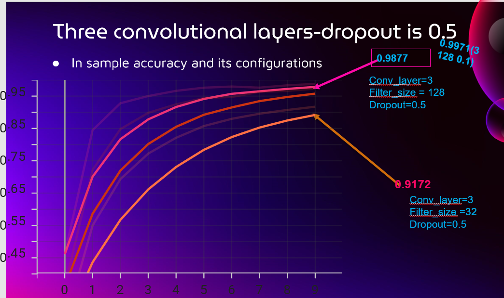 
In the above picture, the in-sample accuracy rate is 0.9877 (conv_layer,filter_size and dropout are 3,128,0.5 respectively.
Based on the requirements given by Brian Yu, i also tried different Max poolings, like [2, 2], [3, 3] and [5, 5], the results are shown as folloows:
The best configuration is at the  convolutional layer 3,filter_size 128 and drop_size is at 0.5.The accuracy is 0.9966 in sample, while the validation accuracy is 0.9894 and the test accuracy is 0.9900.

But the results in test evaluation is unstable, so later I changed optimizer from ADAM into SGD, and increased the learning rate from lower one (0.001) to a higher one (0.05). The results are quite stable and robust. The code running with train set size (0.6) and test set size(0.4) is 0.9961. 
Therefore, finally in my cases the best configuration is :
|conv_layers|filter_size|Dropout_size|pool_size|optimizer|LR|
|-----------|-----------|------------|---------|---------|--|
|3|128|0.5|[2,2]|SGD|0.05|

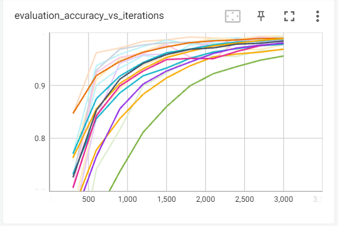

# Summary
This is my journey or my experience to this problem set (CS50ai traffic project). I constructed a model with a sequential big layer with Conv2D, BatchNormalization, Relu Activation, and MaxPooling2D(pool_size and stride are (2,2)). I reused this big layer three times, and then used a Dropout layer with 0.5. Finally, I used Flatten and Dense(with softmax) layers to get the 43 categories output.
I have tried 36 models (with different convolutional layer size, filter_size in Conv2D, and dropout rate), the best configuration is (3, 128, 0.5,[2,2]), corresponding to convolutional layers, filters, dropout and pooling_size respectively. The highest epoch accuracy rate is 0.9971, and the lowest epoch accuracy rate is 0.9605.
Then I tried again of Max-pooling from [2, 2], [3, 3] and [5, 5], I found that [2, 2] is the best in my image classification training set, while the highest accuracy in validation set is the configuration at the setting of [3, 128, [3, 3], 0.1].
There are still some parameters to be tried. For example, I didn't add Dense layer in the convolutional big layer. It is also like hyperparameters, and I can try Dense at 1, 2, or 3 times or with bigger parameters like 512 or 1024 in Dense layer.